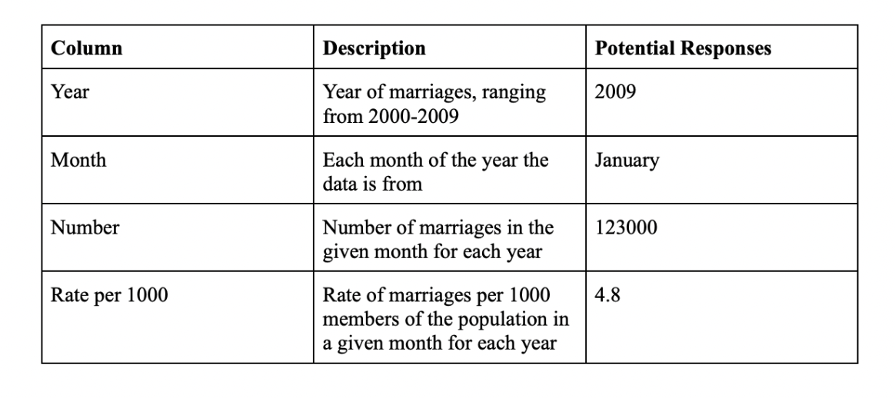
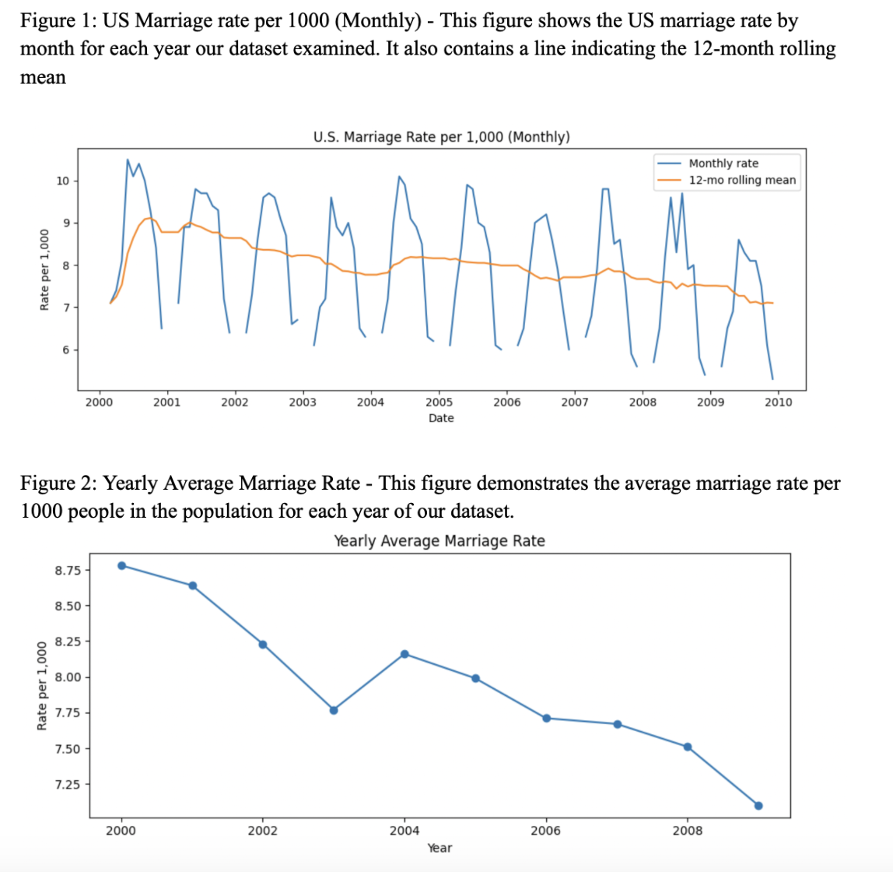

**Data Summary:**  
This data set contains marriage rates by month from 2000-2009. The data has both number of marriages each month and then the rate of marriages per 1000 people in the population  
**Provenance:**  
This data comes from 5 vital national statistics reports created by the CDC.  These annual reports cover statistics on deaths, marriage rates, birth rates and divorce rates. These vital statistical reports are collected by individual states and then put together for the final national reports. For our purposes, we used the annual reports for each year which showed a monthly breakdown of these statistics. Given that these reports often only showed the data for the current year and the year before, we merged them into one csv file to have all annual data from 2000-2009.   
**License:**  
This data was found through CDC reports which fall under public domain. "All material appearing in these reports are in the public domain and may be
reproduced or copied without permission; citation as to source, however,is appreciated."    
**Data Dictionary:**   
  
**EDA Plots:**  
  

